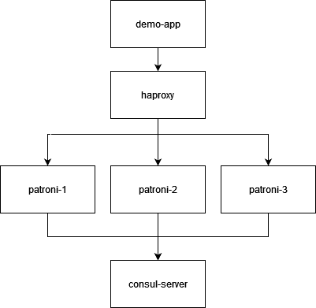

# patroni postgres test 

amalgamation of a variety of example docker-compose deploys for local patroni testing: 
 - https://github.com/zalando/patroni
 - https://github.com/assisken/patroni-consul-docker
 - https://github.com/digitalis-io/postgresql-consul-demo

for further reference:
 - https://github.com/zalando/spilo
 - https://github.com/zalando-stups/stups-etcd-cluster

# what is happening?

- the `demo-app` polls haproxy on port `5432` to check connectivity to the active/primary db
- haproxy is configured to route requests to the 3 patroni instances, using the patroni managed rest api port `8008` to health check status.  only the active/primary db will return a 2xx response and requests will route there.
- patroni will sync with consul cluster and register/deregister themselves as needed to ensure only 1 node is tagged with `master`